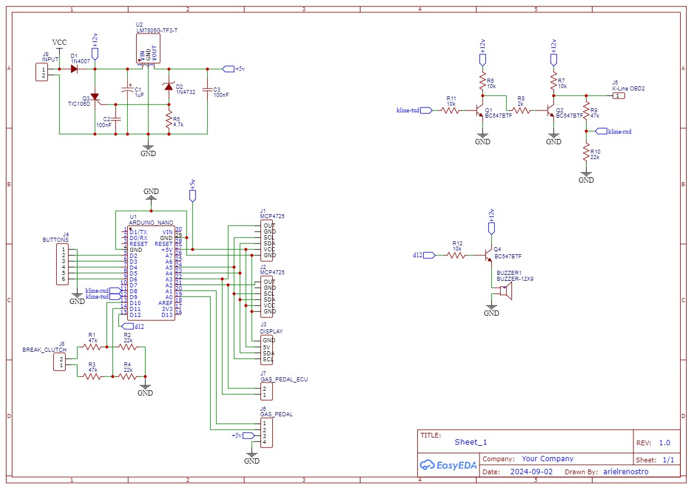

# Arduino PSA Cruise Control

## What is it
It's a throttle pedal middleware to simulate a cruise control and/or a speed limiter for old PSA vehicles (Tested in a Peugeot 206 2003 with Bosch ME7.4.4).

It communicates with K-Line by the OBD2 diagnose port to get vehicle speed for throttle pedal calculations. The only "output" is the throttle pedal signal, which always relays the throttle pedal signal and only simulate the signal when cruise control or speed limiter is enabled.

### Cruise Control
PID implementation using the desired speed to control the throttle output. // TODO: improve this explain.

### Speed limiter
TODO: explain all behaviors

### Security controls
TODO: explain all controls to prevent acidents

## Components
### Arduino
- 1x Arduino Nano AT Mega 328P
- 2x MCP4725 DAC I2C
- 1x OLED 0.96" display I2C

### 5v regulator
- 1x 1N4007 diode
- 1x LM7805 regulator
- 1x TIC106 thyristor
- 1x 5.1V zener diode
- 2x 100nF capacitor
- 1x 47uF capacitor

### K-Line
- 2x BC547
- 1x 47k resistor 1/4W
- 1x 22k resistor 1/4W
- 3x 10k resistor 1/4W
- 1x 2k resistor 1/4W

### Schematics

### PCB design (for an one layer universal PCB)
[!pbc](./docs/board-design.jpg)