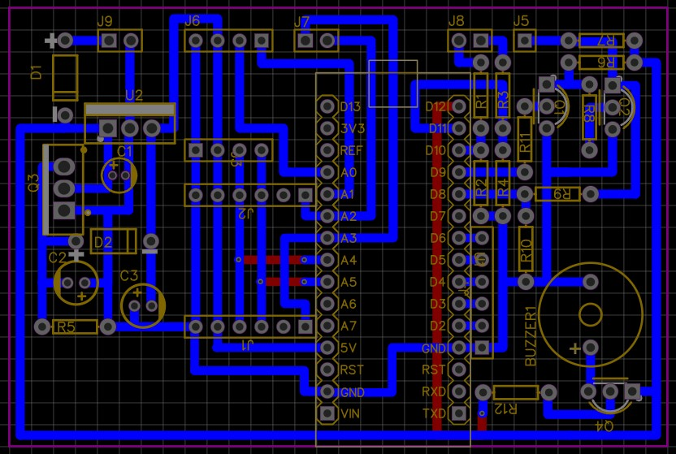

# Arduino PSA Cruise Control

## What is it
It's a throttle pedal middleware to simulate a cruise control and a speed limiter for old PSA vehicles (Tested in a Peugeot 206 2003 with Bosch ME7.4.4).

It communicates with K-Line ISO1430_FAST through the OBD2 diagnose port to get vehicle speed for throttle pedal calculations. The only "output" is the throttle pedal signal, which always relays the throttle pedal signal, except when cruise control or speed limiter is enabled.

K-Line is always been readed and vehicle speed is consistently requested and updated in memory.

### Cruise Control
PID simple implementation, using user's desired speed as set point, actual speed (from K-Line) as input and throttle position as output. It's kind a weird use diferent mesures for input and output, but it works!

### Speed limiter
The speed limiter consists in monitoring vehicle speed and cuts user's throttle if speed overpass the desired speed. User can temporarily bypass this limiter by pushing the pedal more than 10% of required to keep the speed. It will be disabled until speed keeps bellow the desired speed for more than 5s;

### Security controls and alerts
* K-Line slow response or connection lost: if it happens, the cruise control or speed limiter will be disabled, giving all the control to user;
* User throttle request: if user pushes the pedal more than 10% that is required to keep speed, the speed limiter will be temporarily disabled until speed keeps bellow the desired speed for more than 5s;
* Overspeed: a speed limit alert is always fired every time that vehicle excedes more than 5km/h of desired. 

## Components
### Arduino
- 1x Arduino Nano AT Mega 328P
- 2x MCP4725 DAC I2C
- 1x OLED 0.96" display I2C

### 5v regulator
- 1x 1N4007 diode
- 1x LM7805 regulator
- 1x TIC106 thyristor
- 1x 5.1V zener diode
- 2x 100nF capacitor
- 1x 47uF capacitor

### K-Line
- 2x BC547
- 1x 47k resistor 1/4W
- 1x 22k resistor 1/4W
- 3x 10k resistor 1/4W
- 1x 2k resistor 1/4W

### Buzzer
- 1x Buzzer 12v
- 1x BC547
- 1x 10k resistor 1/4W

### Schematics

### PCB design (for an one layer universal PCB)

## Real project
TODO: take real pictures of it.